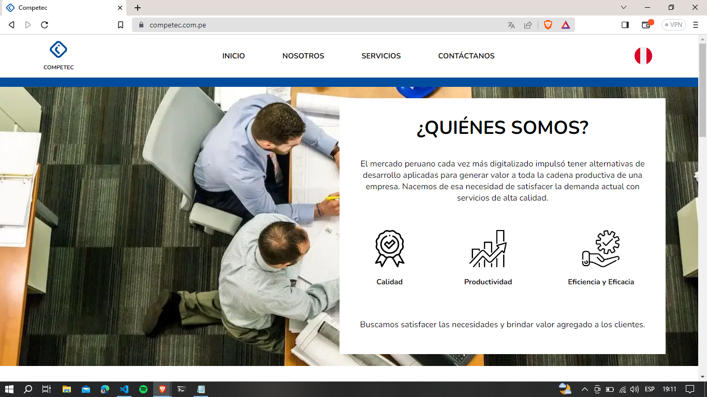

# Competec Website

## Welcome! 👋

This is the official Competec website.

## Links!

  - Solution URL: [competec.com.pe](https://competec.com.pe/)
  
## My process

I learned how to design the page from scratch, develop it using React and its Hooks, and I learned how to use ViteJs as a packager.

## Built with: 

- React Js, React Hooks
- JavaScript
- Semantic HTML5 markup
- CSS custom properties, animations and transitions
- Responsive design
